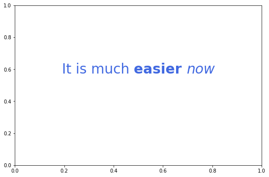

[](https://pypi.org/project/flexitext/)
[](https://github.com/tomicapretto/flexitext/actions/workflows/test.yml)
[](https://github.com/ambv/black)
[](https://codecov.io/gh/tomicapretto/flexitext)


# Introduction

Flexitext is a Python library that makes it easier to draw text with multiple styles in Matplotlib. This library is inspired and influenced by the R package [`ggtext`](https://wilkelab.org/ggtext/).


## Installation

Flexitext requires a working Python interpreter (3.7+). This library can be installed using pip:

    pip install flexitext

Alternatively, you can install the development version from GitHub:

    pip install git+https://github.com/tomicapretto/flexitext.git


Flexitext only requires Matplotlib version 3.4 or higher.


## Overview

Albeit being inspired on [ggtext](https://wilkelab.org/ggtext/), Flexitext does not use HTML, CSS, or Markdown to specify text styles. On the contrary, it implements a tag-based styling that looks similar to HTML tags, but is not exactly like HTML. These formatted strings consist of three components:

* An opening tag that defines the styles to apply.
* The text to be styled.
* A closing tag, indicating the extent to which the styles in the opening tag apply.

Let's see an example:

```python
"<color:blue, size:16>This is blue text</> and this is regular text"
```

* <code>&lt;color:blue, size:16></code> is the opening tag. Styles are key-value pairs separated by `:`. Multiple styles are separated by commas.
* `This is blue text` is the text block. This text is going to be drawn using a font size of 16 and blue color.
* <code>&lt;/></code> is the closing tag. Only the text within the opening and the closing tags is formatted.

And finally we have ` and this is regular text`. This is going to be drawn using the default style because it is not contained within any formatting tags.


## Examples

The easiest way to use `flexitext` is through the `flexitext` function.


```python
import matplotlib as mpl
import matplotlib.pyplot as plt

from flexitext import flexitext

mpl.rcParams['figure.facecolor'] = 'w'
```


```python
fig, ax = plt.subplots(figsize=(9, 6))

text = "Normal text"
ax.text(0.5, 0.7, text, size=24, ha="center")

text = "<weight:bold, size:24>Bold text</>"
flexitext(0.5, 0.6, text, ha="center")

text = "<style:italic, size:24>Italic text</>"
flexitext(0.5, 0.5, text, ha="center")

text = "<weight:bold, size:24>Bold and</> <style:italic, size:24>italic too!</>"
flexitext(0.5, 0.4, text, ha="center");
```


    

    


Styles can be nested


```python
fig, ax = plt.subplots(figsize=(9, 6))

text = "<size:28, color:royalblue>It is much <weight:bold>easier </><style:italic>now</></>"
flexitext(0.5, 0.6, text, ha="center");
```


    

    


A more convoluted example:


```python
text = (
    "<size:28, color:blueviolet, name:Montserrat>You can write using\n</>"
    + "<color:grey, size:24>multiple formats,\nand linebreaks\n\n"
    + "<color:royalblue, name:Montserrat>also <weight:bold>bold text\n\n</></>"
    + "<name:Montserrat>and why not <color:royalblue, style:italic>italics</> too</></>"
)

fig, ax = plt.subplots(figsize=(9, 6))
flexitext(0.5, 0.5, text, ha="center", ma="center");
```


    

    


Use the figure fraction coordinates to write a formatted title.


```python
fig, ax = plt.subplots(figsize=(9, 6))
fig.subplots_adjust(top=0.8, left=0.025)

x = [1, 2, 3]
y_blue = [2, 2.7, 4.5]
y_red = [1, 3, 2.5]


ax.scatter(x, y_blue, color="royalblue", s=120)
ax.scatter(x, y_red, color="crimson", s=120)

# Add flexitext
text = (
    "<name:Montserrat><size:24>A <weight:bold>great chart</> showing</>\n"
    + "<size:18>the values for the "
    + "<color:royalblue, weight:bold>blues</> and the <color:crimson, weight:bold>reds</></></>"
)
flexitext(0.025, 0.8, text, va="bottom", xycoords="figure fraction");
```


    

    


## Notes

Flexitext only supports the following styles

* alpha
* backgroundcolor
* color
* family
* name
* size
* style
* weight

See [Matplotlib's documentation](https://matplotlib.org/stable/api/_as_gen/matplotlib.axes.Axes.text.html#matplotlib.axes.Axes.text) for more information about their meaning and available values.

Flexitext logo is created with Flexitext and Matplotlib (see [here](https://github.com/tomicapretto/flexitext/tree/main/docsite/logo.ipynb)).
