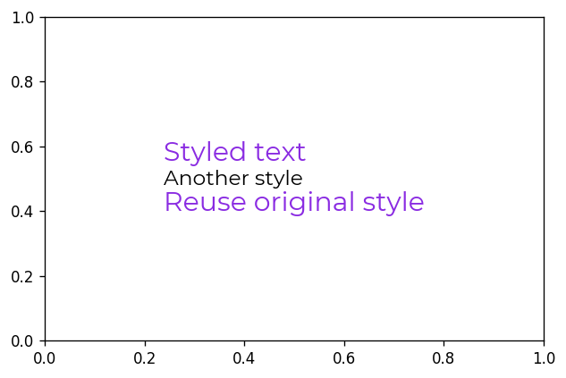
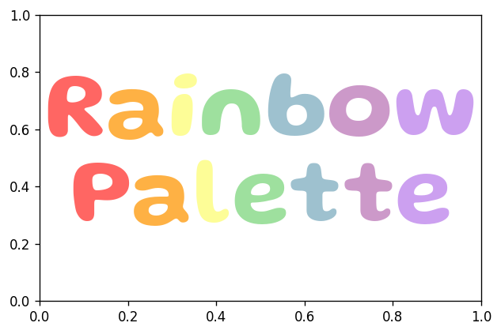

# Object-Oriented Interface

Flexitext provides the [`FlexiText()`](../../reference/FlexiText) class. This class is wrapped by the `flexitext()` function to provide the functional implementation. Unlike the functional implementation, this class based implementation does not work with formatted strings. It works with instances of the class `flexitext.Text`. These are lower level objects that contain both the text and the styles, given by an instance of `flexitext.Style`.


## Setup


```python
import matplotlib as mpl
import matplotlib.pyplot as plt

from flexitext import FlexiText, Style

mpl.rcParams["figure.figsize"] = (6, 4)
mpl.rcParams["figure.dpi"] = 120
```

## `Style` class

The `Style` class stores styles that are applied to some text. Its arguments are the names of the styles supported (see [here](https://tomicapretto.github.io/flexitext/#notes)). 


```python
style = Style(color="blueviolet", size=18, name="Montserrat")
print(style)
```

    Style(color=blueviolet, name=Montserrat, size=18)


This style object can be called with a string we would like to format and it returns an instance of `flexitext.Text`.


```python
text = style("Styled text")
print(text)
```

    Styled text


```python
print(text.style)
```

    Style(color=blueviolet, name=Montserrat, size=18)


## `FlexiText` class

`FlexiText` objects are created with a variable number of `Text` objects. Then we call the `.plot()` method, which accepts the same arguments than `flexitext()`, and draw the all the texts with their corresponding styles.


```python
fig, ax = plt.subplots()

FlexiText(text).plot(0.5, 0.5, ha="center");
```


    

    


This interface allows us to re-use styles.


```python
style2 = Style(size=14, name="Montserrat")

fig, ax = plt.subplots()

ft = FlexiText(
    style("Styled text\n"), 
    style2("Another style\n"), 
    style("Reuse original style")
)

ft.plot(0.5, 0.5, ha="center");
```


    

    


## More examples

The object-oriented interface is useful when you want to create styles in a programatically way without dealing with strings and when you want to re-use those styles. Let's see an example:


```python
RAINBOW_COLORS = ["#FF6663", "#FEB144", "#FDFD97", "#9EE09E", "#9EC1CF", "#CC99C9", "#CCA0F0"]

# Create list of styles
styles = [Style(size=72, color=color, name="Gluten", weight=600) for color in RAINBOW_COLORS]

# Create lists of texts
texts1 = [s(letter) for s, letter in zip(styles, "Rainbow")]
texts2 = [s(letter) for s, letter in zip(styles, "Palette")]

# Create plot
fig, ax = plt.subplots()
FlexiText(*texts1).plot(0.5, 0.65, ha="center");
FlexiText(*texts2).plot(0.5, 0.35, ha="center");
```


    

    

