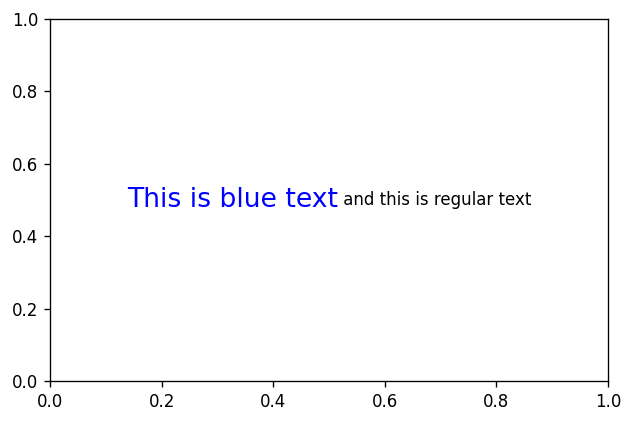
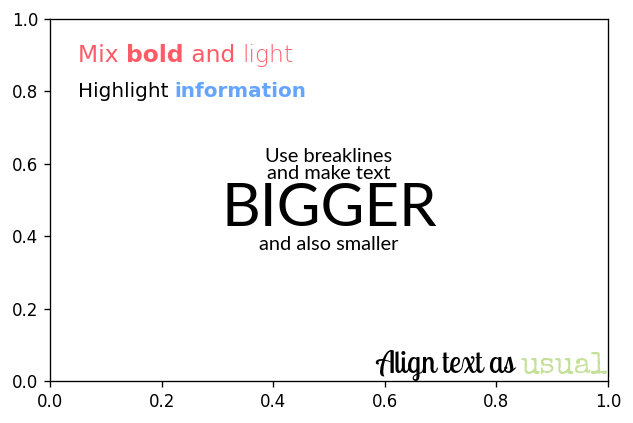

# Functional

Flexitext provides the `flexitext()` function. With the exception of the formatted strings, it works in the same way than the `.text()` method on Matplotlib's `Axes` objects. You can see its full documentation [here](../../reference/flexitext).

## Setup


```python
import matplotlib as mpl
import matplotlib.pyplot as plt

from flexitext import flexitext

mpl.rcParams["figure.figsize"] = (6, 4)
mpl.rcParams["figure.dpi"] = 120
```

## Formatted strings

Albeit being inspired on [ggtext](https://wilkelab.org/ggtext/), Flexitext does not use HTML, CSS, or Markdown to specify text styles. On the contrary, it implements a tag-based styling that looks similar to HTML tags, but is not exactly like HTML. In Flexitext, formatted text consists of three components:

* An opening tag that defines the styles to apply.
* The text to be styled.
* A closing tag, indicating the extent to which the styles in the opening tag apply.

Let's see an example

```python
"<color:blue, size:16>This is blue text</> and this is regular text"
```

* `<color:blue, size:16>` is the opening tag. Styles are key-value pairs separated by `:`. Multiple styles are separated by commas `,`.
* `This is blue text` is the text block. This text is going to drawn using a font size of 16 and a blue color.
* `</>` is the closing tag. Only the text within the opening and the closing tags is formatted.

Then we have ` and this is regular text`. This is going to be drawn using the default style because it is not contained within any formatting tags.


```python
fig, ax = plt.subplots()

text = "<color:blue, size:16>This is blue text</> and this is regular text"
flexitext(0.15, 0.5, text);
```


    

    


## Examples

Flexitext supports [a variety](https://tomicapretto.github.io/flexitext/#notes) of styles. You can change color, transparency, font, style, weight, etc. The following examples showcase how to customize text in different ways using `flexitext()` and formatted strings.


```python
colors = ["#ff5c67", "#fe7974", "#ffb382", "#c5e099", "#64a5ff"]
```


```python
fig, ax = plt.subplots()

flexitext(
    0.05, 0.9, 
    "<size:14, color:#ff5c67>Mix <weight:bold>bold</> and <weight:light>light</></>"
)

flexitext(
    0.05, 0.8, 
    "<size:12>Highlight <weight:bold, color:#64a5ff>information</></>"
)


text = (
    "<size:12, name:Lato>Use breaklines\n"
    + "and make text\n<size:36>BIGGER</>\n"
    + "<size:12>and also smaller</></>"
)

flexitext(
    0.5, 0.5, 
    text,
    ha="center",
    ma="center"
)

text = (
    "<size:18, name:Lobster Two>Align text as "
    + "<color:#c5e099, weight:bold, name:Special Elite>usual</></>"
)

flexitext(
    1, 0, 
    text,
    ha="right",
    va="bottom"
);
```


    

    


```python
fig, ax = plt.subplots()
fig.subplots_adjust(top=0.8)

flexitext(
    0, 1, "<size:22><color:red>Axes</> fraction</>", 
    va="top"
);

flexitext(
    0.9, 0.82, 
    "<size:22><color:red>Figure</> fraction</>", 
    va="bottom", ha="right", 
    xycoords="figure fraction"
)

flexitext(
    0.9, 0.02, 
    "Usefool for <style:italic, weight:bold>captions</>", 
    ha="right", 
    xycoords="figure fraction"
)

flexitext(
    0.5, 0.6, 
    "<size:22>Some <alpha:0.3>transparency</></>",
    ha="center"
)

flexitext(
    0.5, 0.4, 
    "<size:22>And <family:monospace, color:red>monospace</> too</>",
    ha="center"
)

text = "<size:14>break</>\n<size:12>break</>\n<size:10>break</>"

flexitext(0, 0, text, va="bottom");

flexitext(0.5, 0, text, ha="center", ma="center", va="bottom");

flexitext(1, 0, text, ha="right", ma="right", va="bottom");
```


    

    

